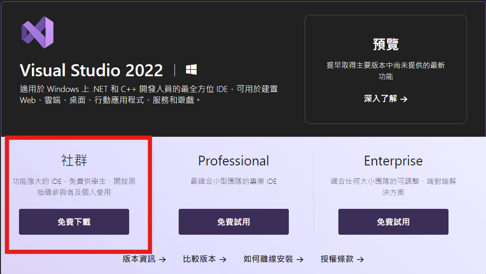
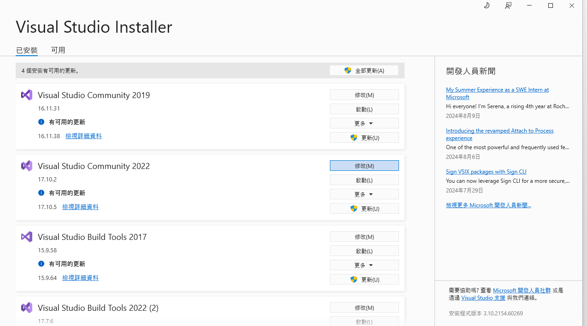
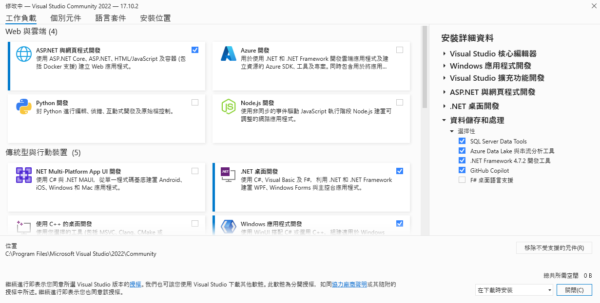

## 第一步
[Visual Studio 下載](https://visualstudio.microsoft.com/zh-hant/downloads/)

## 第二步
- 使用Visual Studio Installer 安裝相關套件

## 第三步
- 依需求選擇安裝項目
    - AspNet與網頁程式開發 (web)
    - Net桌面開發(桌面應用開發)
    - 資料儲存與處理
    - 安裝Net 6 ~ 8
    - 若有舊專案需求可安裝Net Framework

