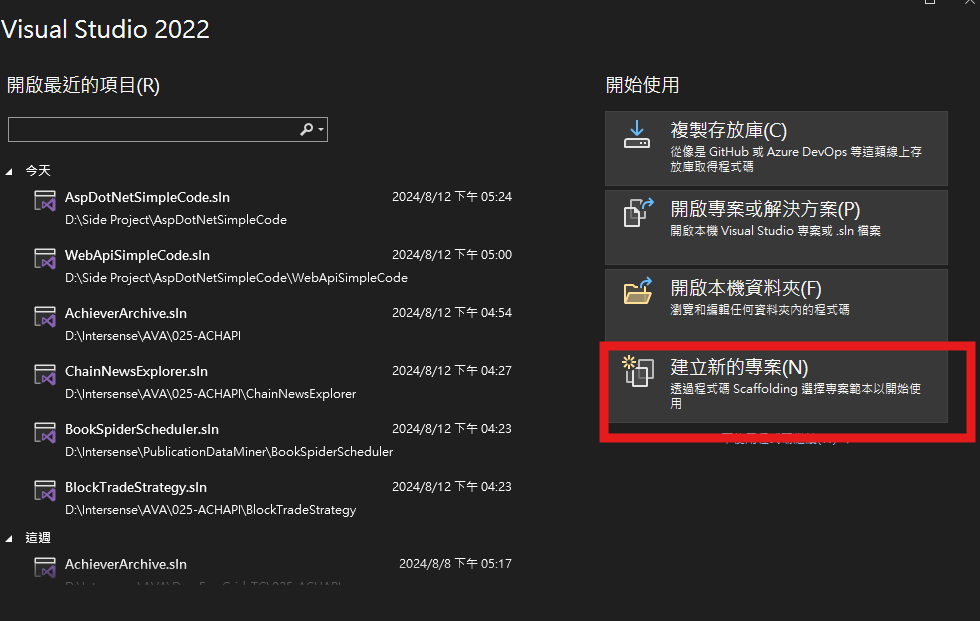
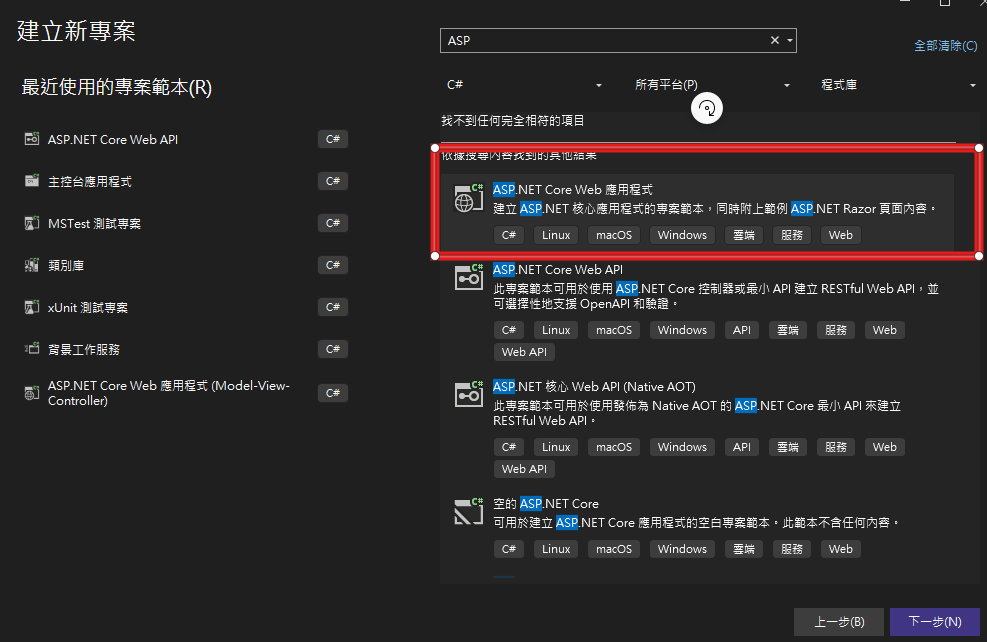
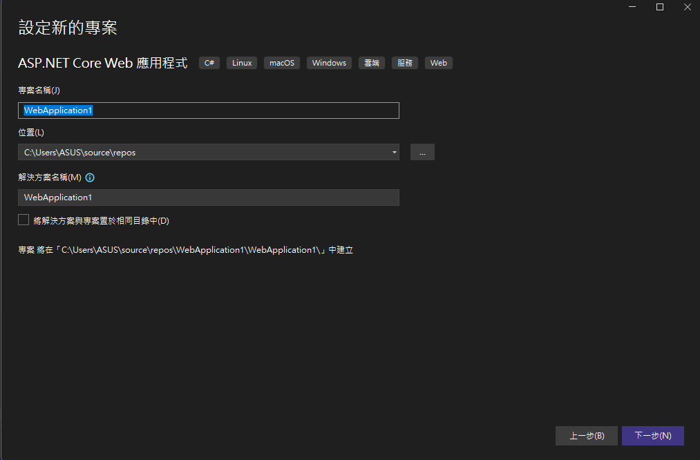
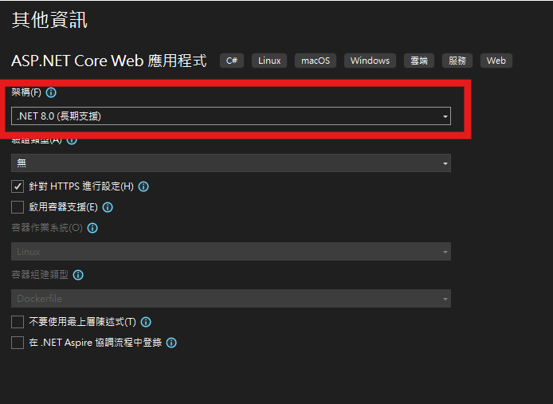
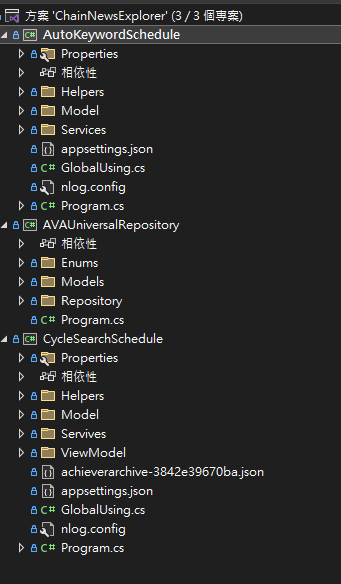

# Asp Dot Net Web API 教學

## 第一步
建立一個新的專案，選擇 ASP.NET Web Application 範本，並命名為 `WebAPISimpleCode`。

## 第二步
選擇 Web API 範本，並點擊確定。

## 第三步
專案建立後，確認專案結構如圖所示。

## 第四步
添加一個新的控制器來處理 Web API 請求。

## 方案與專案之間的關係
以下圖片說明了方案與專案之間的關係。

## 結論
本教學展示了如何在 ASP.NET 中建立一個簡單的 Web API 專案，並簡要介紹了相關的專案結構和配置。
