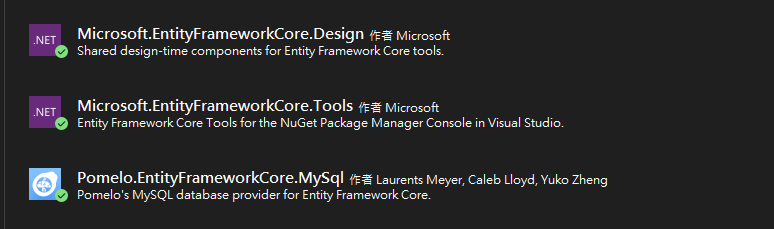

# Web API Simple Code - MySQL DB First 開發

## 相關 NuGet 套件

在本項目中，我們使用了以下 NuGet 套件來實現 MySQL 與 Entity Framework Core 的整合，並進行 DB First 開發：

### Pomelo.EntityFrameworkCore.MySql 

- **MySQL 支援**：
  - `Pomelo.EntityFrameworkCore.MySql` 是一個為 MySQL 提供支持的 Entity Framework Core 提供者。它允許你在 .NET 應用程式中使用 Entity Framework Core 來與 MySQL 資料庫進行交互。
  - 此套件提供了與 MySQL 資料庫進行交互的所有必要功能，包括 LINQ 查詢、遷移 (migrations) 和模型映射。
  - 當進行 DB First 開發時，這個套件能幫助你從現有的 MySQL 資料庫生成對應的 C# 模型和 `DbContext` 類。

### Microsoft.EntityFrameworkCore.Design 

- **設計時支援**：
  - `Microsoft.EntityFrameworkCore.Design` 提供了設計時所需的工具，用於進行遷移 (migrations)、模型生成，以及 `DbContext` 的設計。
  - 這個套件包含了設計時的核心邏輯，例如在使用 `dotnet ef` 命令時所需的基礎設置。
  - 在進行 DB First 開發時，該套件提供了從現有資料庫生成模型的基礎邏輯。
  - 當進行遷移設計時，這個套件提供了必需的支持，使得遷移能夠順利生成和應用。

### Microsoft.EntityFrameworkCore.Tools 

- **命令行工具**：
  - `Microsoft.EntityFrameworkCore.Tools` 提供了開發人員使用的命令行工具，允許你在開發過程中使用 `dotnet ef` CLI 命令來管理遷移、更新資料庫、生成模型和執行各種資料庫操作。
  - `dotnet ef` 命令是透過這個套件實現的，它擴展了命令行工具的功能，使得你能在開發過程中更方便地進行資料庫操作。
  - 當需要生成資料庫的設計並進行 DB First 開發時，這個工具讓你能通過命令行來快速完成這些任務。

## ORM (Object-Relational Mapping)

在本項目中，我們使用了兩種主要的開發方法來進行資料庫與模型的映射：DB First 和 Model First。

### DB First
DB First 是從現有的資料庫結構出發，生成對應的模型和 `DbContext` 類別。這種方法適合在已有資料庫或需要基於現有資料庫進行開發時使用。

要使用 DB First 方法生成模型，請使用以下命令：

~~~sh
Scaffold-DbContext "server=127.0.0.1;port=3306;database=tutorial_db;user=root;password=" Pomelo.EntityFrameworkCore.MySql -o ./Models/Context -f -Context "TutorialDbContext" -NoOnConfiguring
~~~

### 解釋：
- **ORM (Object-Relational Mapping)**：ORM 是一個能夠將程式中的物件和資料庫中的關聯式資料表映射的技術，它簡化了資料庫操作的代碼。
- **DB First**：從資料庫結構生成應用程式模型，適用於已有資料庫的情境。
- **Model First**：從模型生成資料庫結構，適用於需要自行設計資料庫的情境。

