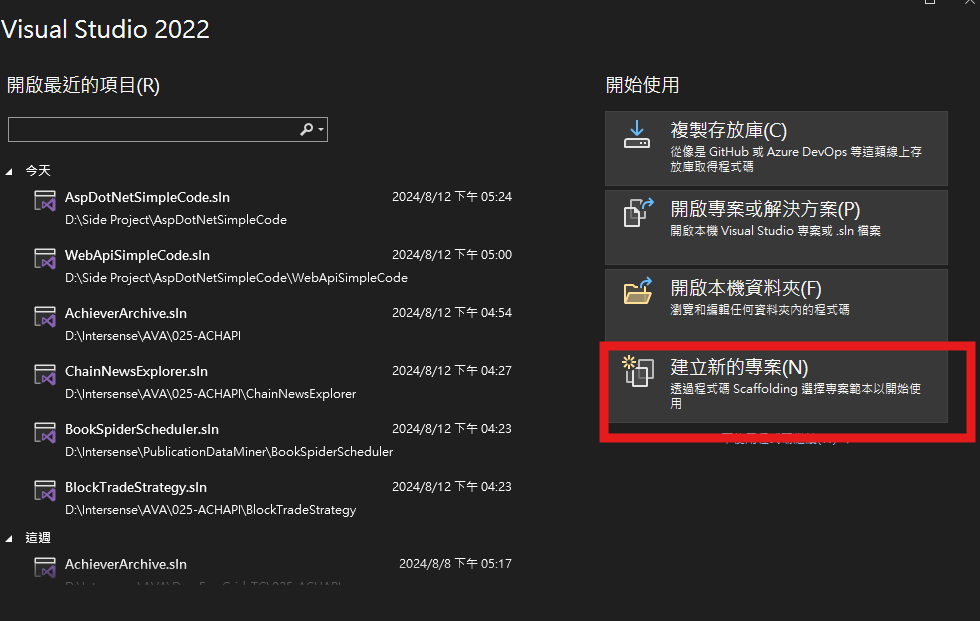
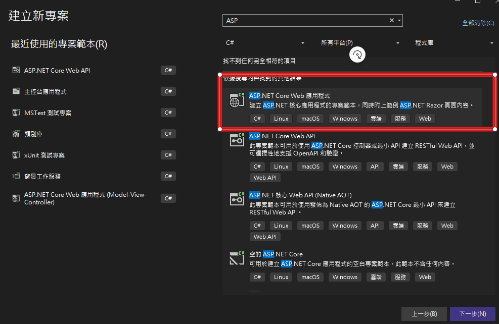
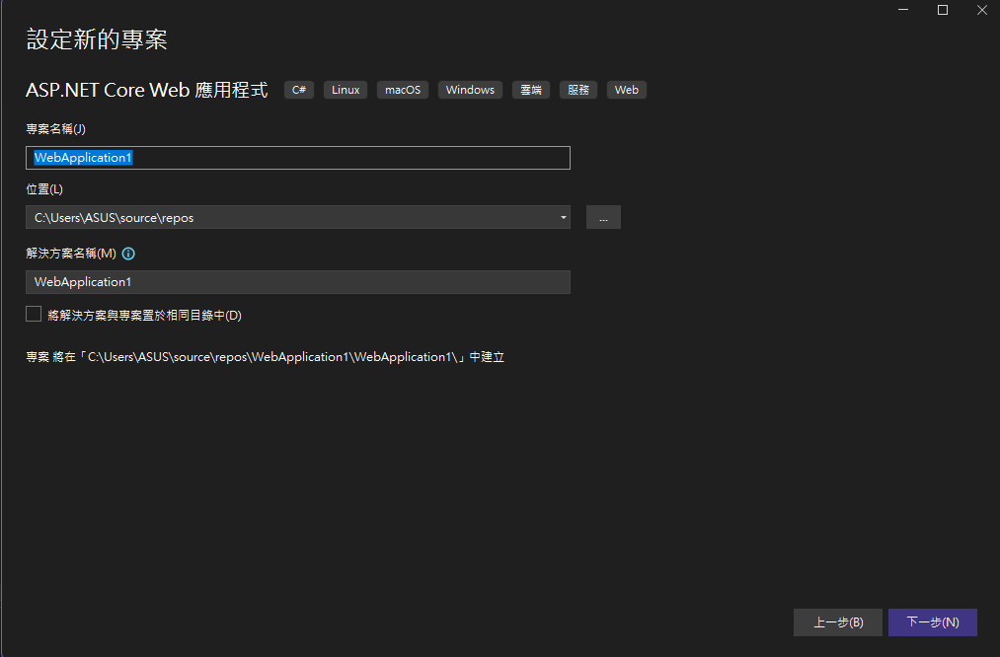
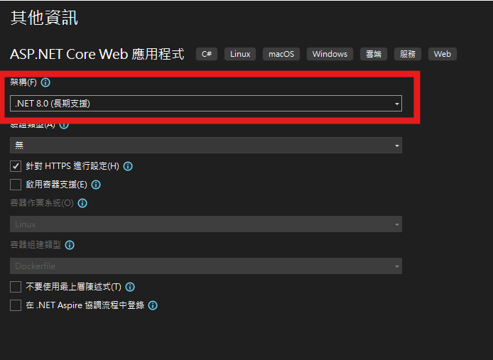
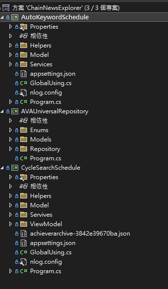

# Asp Dot Net Web API 教學

## 第一步
建立一個新的專案，選擇 ASP.NET Web Application 範本，並命名為 `WebAPISimpleCode`。

## 第二步
選擇 Web API 範本，並點擊確定。

目前Asp Dot Net 主流框架
- Asp .Net Core
	- 可跨平台開發(Windows,macOS,Linux)
	- 
- Asp .Net Framework(不可跨平台 ,4.8.1以後不在更新) 
	- 一般而言Net 5 以前的本版是指Asp .Net Framework , Net 5 以後是指Asp .Net Core ,若5以前會特別強調例如:Asp .Net Core 3.1
	- 
- Asp .Net Mvc
	- 通常應用於全端開發，前後端高度耦合
	- 目前主流有Razor 和 Blazor
	- 也有Asp .Net Core 和 Asp .Net Framework
	- 
-WPF
	- 目前最新之桌面應用開發框架
	
- Winform(老舊框架)
	- 電腦桌面應用開發
	
-webform(老舊框架)
	- 網頁開發

## 第三步
專案建立後，確認專案結構如圖所示。

## 第四步
添加一個新的控制器來處理 Web API 請求。

## 方案與專案之間的關係
以下圖片說明了方案與專案之間的關係。

## 結論D
本教學展示了如何在 ASP.NET 中建立一個簡單的 Web API 專案，並簡要介紹了相關的專案結構和配置。
